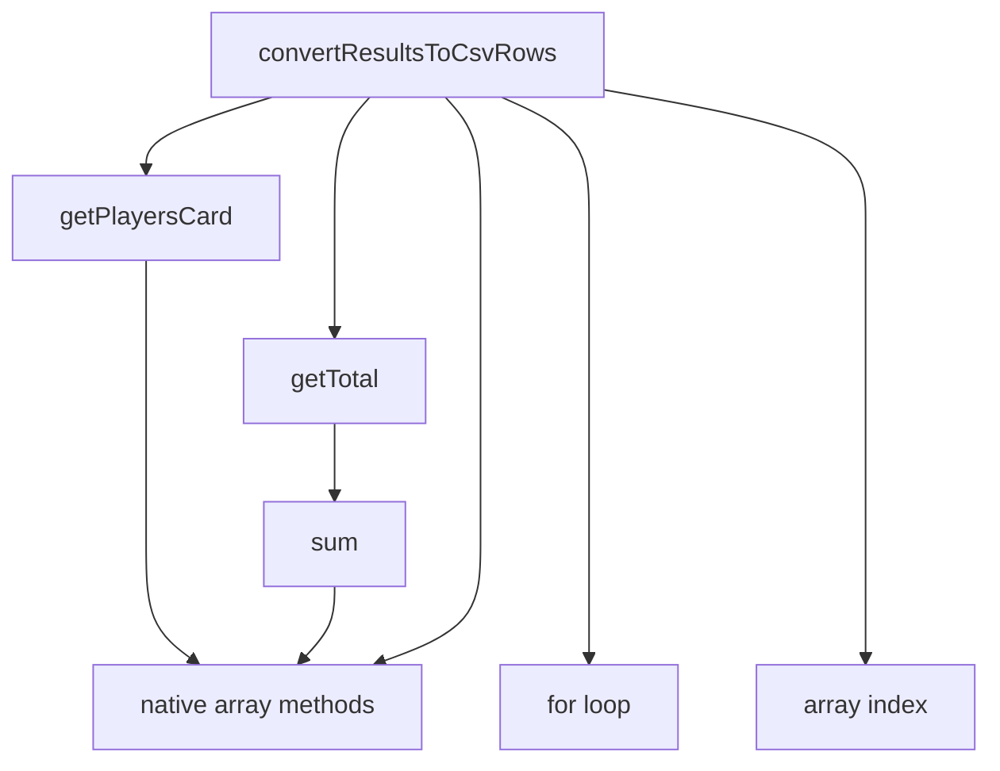
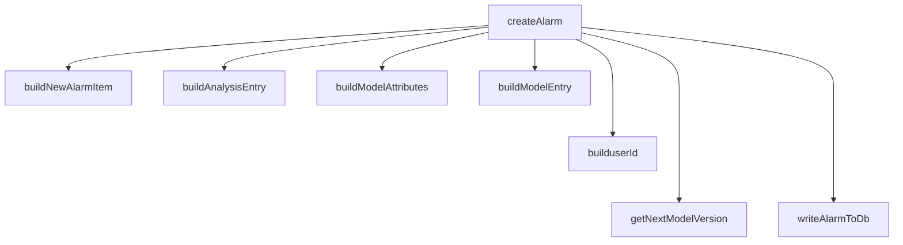
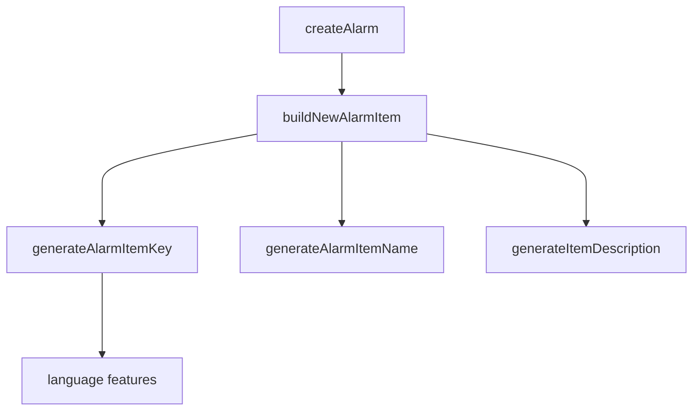
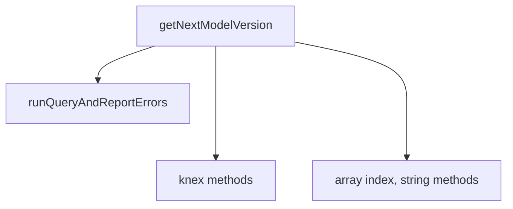
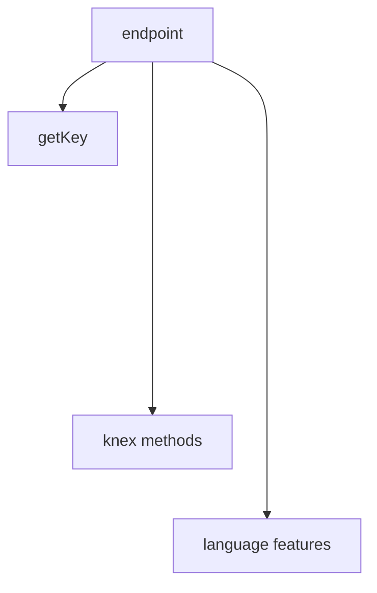
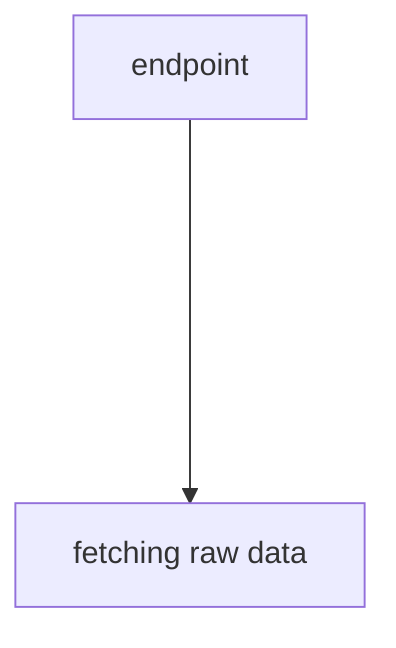
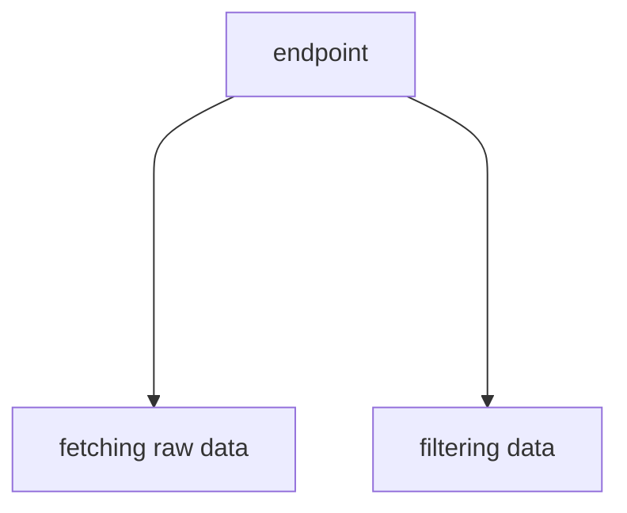
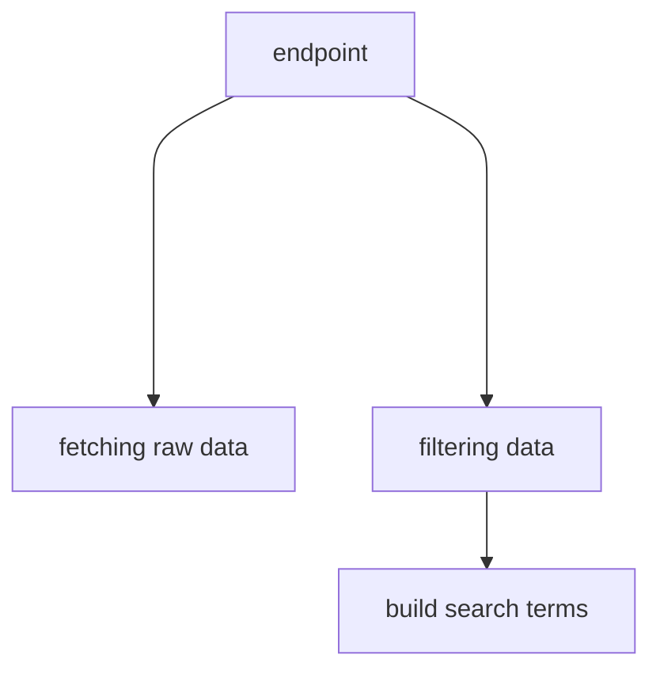
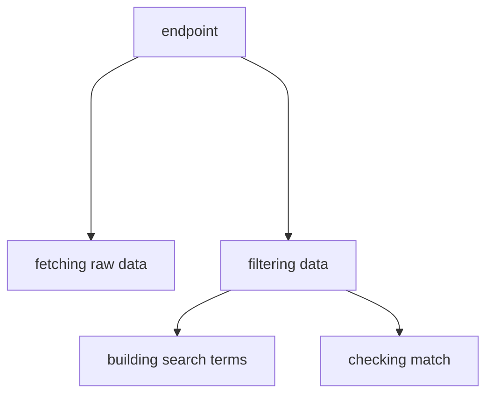
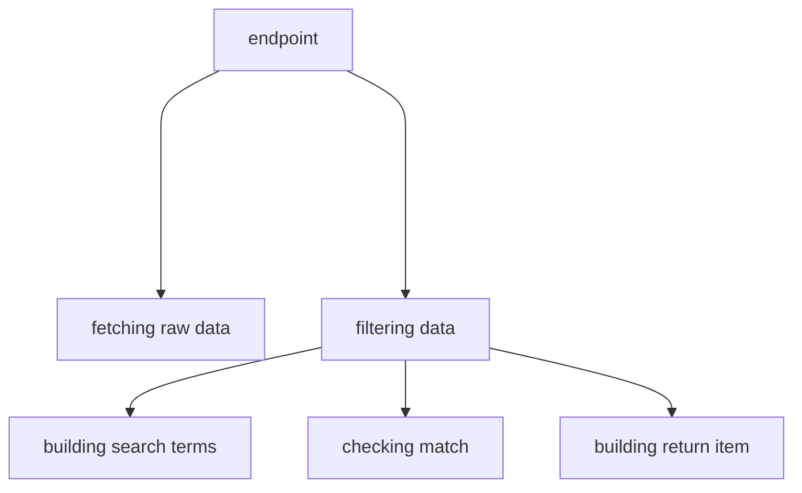

# Refactoring with stratified design

Juho Härme

<!--

Hi there, so, my talk is not about the cool new frameworks out there, but about
something mysterious called Stratifies design....

.... add Knowit logos etc

My name is Juho, I work at Knowit as a software developer and since we are in Turku I cannot help 
mentioning that even though I am based in Lempaala and work in Tampere my first dev job was actually in Turku
writing a project for the faculty of linguistics.. And talking about design and refactoring... I sure think
that would be a good source of examples... But let's not go there.

Rather, let's talk about these strange terms... stratitfied.. and refactoring...

And there's another word - refactoring.... Ideally, you would want to talk about designing and
how you start a new project with a perfect design, a perfectly clear way to think
about code and structure, but we all know how it is in the real world:
rather than writing new code on a clean sheet we end up reading old code.

And old code tends to be messy. And tedious to understand. And you are trying
to just fix this small bug in the way the user sees the train ticket prices
rendered on the screen...

Stratified design is a tool that could possibly help with this tedious everyday task.

-->

---

---
layout: intro
other: none
---

# Outline

<v-clicks>

- Some background
- Stratified design as a concept
- A  modified example based on a real-world API

</v-clicks>

<!--

So, just to quickly sum up the journey I'm trying to take you guys onto:

- First, a bit of background: why is this a thing
- Then let's define the terms and de-mystify the word stratified
- And after that's out of the way let's look at an example


-->

<v-click>


</v-click>

<!--

Stratified is a past participle form of an English verb which comes from ... surprise, surprise..
a Latin noun, stratum,  meaning.. well, basically, something layered, in today's speech. You would, of course,
recognize other derivatives such as stratosphere etc.

So we are going to talk about layers and look at code the same way ew can look that rock there
showing different layers of chalk. Which is probably a good comparison to a lot of my own code, at least. chalk.

-->

---

# What's the point?

<v-clicks>

- Readability, maintainability, testability etc
- Ability to work on the correct level of detail
- Power of conceptualization

</v-clicks>

<!--

Why would we want to follow a pattern, something like stratified design when writing our code?

Well, of course, there are these three fellows: readability, maintainability, testability. There
is a big difference in all those if we compare a code base designed according to something
and code that is just... well, written, to solve a particular problem at a particlar time.

And if we look at stratified design in particular, a special gain, something we hope to get with
this is the ability to focus on the right stuff, not to worry about details belonging to another
layer when you're working on another.

One thing I do want to emphasize here is the fact that this is probably nothing  new to any of you.
This is probably something you all do, at least to some extent, intuitively and naturally in your
everyday work when reading your co-workers' pull requests and making comments like
'this would be more readable if you would extract thing here' ... or  just having
a feeling that some piece of code could be structured differently without
being quite able to describe the problem in words. Tools like stratified design
are there to help us conceptualize these kind of feelings: they are a tool for us to communicate
and that's what is imprtant. You can probably make the same kinds of conceptualizations
with other tools, but this is one I have personally found useful.


-->

---

<v-clicks>

```typescript{0|1-4|5-9|10-13}
const users: Player = [
  { name: "Paul", id: 1, strokes: undefined, rank: undefined },
  { name: "Ricky", id: 2, strokes: undefined, rank: undefined },
];
const holes: Hole = [
  { no: 1, par: 3 },
  { no: 2, par: 3 },
  { no: 3, par: 4 },
];
const scoreCards: ScoreCard = [
  { userId: 1, strokes: [2, 2, 4] },
  { userId: 2, strokes: [2, 2, 3] },
];
```

</v-clicks>

<!--

Now before diving into the real world example I promised to show you, let's look
at something totally contrived.   Here's some data in the form of typescript objects

This piece of data has players.. Competing in the sport of disc golf... Which is done by
playing holes, which would ideally be completed within three or four strokes.

So when our player play through the holes they fill in a score card representing how well they
have performed on the course.

-->

---
layout: two-cols
clicks: 14
---

```typescript{11-27|0|14|23|13,17|18,19,20|21|all|13,17,18,19,20,24|3-5|7-8|0|all}
import sum from "mathlib";

const getTotal = (results: number[]) => {
  return sum(results);
};

const getPlayersCard = (player: Player, scoreCards: ScoreCard[]) => {
  return scoreCards.find((scoreCard) => scoreCard.playerId === player.id);
};

const convertResultsToCsvRows = (players: Player[]): string[] => {
  let rows: string[] = [];
  for (let player of players) {
    const card = getPlayersCard(player, scoreCards);
    let row: ScoreRow[] = [];
    let results: number[] = [];
    for (let i = 0; i < holes.length; i++) {
      const hole = holes[i];
      const strokes = card.strokes[i];
      const par = holes[i].par;
      results.push(strokes - par);
    }
    const total = getTotal(results);
    rows.push([...results, total].join(","));
  }
  return rows;
};
```

::right::

<ul>
<li v-click="8">native language features</li>
<li v-click="9">generic function</li>
<li v-click="10">specific functions of domain X  </li>

</ul>

<v-click at="12">



</v-click>

<!--

Now, let's imagine we want to calculate each player's results and turn them into
a csv file. This made-up code right here might be one way to do it.

We have a function called convertResultsToCsvRows which is basically going through
each player, finding their scorecards...

Calculating the total strokes for each player...

by looping through each hole they played...

and looking at how many strokes they have in their scorecard

and getting their result by subtracting the par of the hole


But you definitely don't get a particular sense of design by looking at this code.
It's not straightforward to know what are the right details I should be worried aout at
each stage of the code and if I were to have to add some new functionality to this code
or perhaps fix a bug, I would have to spend a good amount of time scanning through each line
and thinking about what it should be doing.

So we get the sense that this code could use some refactoring, but the problem is: how to
communicate that? Let's see, how stratified design could be used as a tool to conceptualize this.

If you recall from the beginning, stratified basically means layered, so we're looking for layers
in the code. The basic idea is that a well designed code would work on a reasonable number of
layers so that each layer contains elements that belong to the same domain or deal with the same
level of detail. With such a layered design, it should be easy for us to quickly find the place
dealing with the functionality we are interested in at the moment.

Now stratified design is essentially a concept associated with functional programming. This means
that a typical way to arrange the code into layers is to work with multiple different functions
each consisting of logic belonging to a similar kind of layer. If a function deals with multiple different
kinds of layers at the same time, that is usually a sign that the reader of the function is probably
going to have to use a lot of mental capacity to navigate through it. A function working mainly
on a single related layer could be called straightforward and is generally something you would want to achieve

So, looking at this convertResultsToCsvRows function here you could identify,
for instance, these kinds of layers:

- we have native language features such as for loops, accessing an array by
  index and using array methods such as pushing, joining....
- We also call another function of a rather generic nature called getTotal
  which sums up an array using anoter, more generic function
- And call another function, but this time it's not a generic one outputting a
  result of a mathematical operation but rather a lot more specific one,
  dealing with players and their scorecards

So we could say that the convertResultsToCsvRows function is basically working
on three or four different layers.  This could be represented with a call graph,
where we try to represent the relationship of each of these layers by drawing a
line from our current function to the the features and functions it uses.
Like this:

So the idea here is that at the very bottom we have the low-level stuff, the
language features like for loops and accessing an array by index.

Then the more generic function calls are closer to these and the more
domain-specific ones closer to the top. So if we were to refactor this, we
could use this as a starting point and think about how we could have the
functions yield a different kind of graphs, ideally one where all the arrows
would be of roughly the same length and point to same kinds of constructs. That
would be the first step of converting the function to a straightforward
implementation.


-->

---
other: none
clicks: 5
---

# Examples from a KOA api

```typescript{0|all|5|7|5}
router.post(
  "/api/alarms",
  async (ctx) => {
    const alarmProps = validatePostAlarmProps(ctx.request.body);
    await createAlarm(alarmProps);
    ctx.status = 200;
    ctx.body = { message: "Alarm created" };
  },
);

```

<!--

Now let me move on to the more realistic example promised earlier.

Here we have a nodejs api built using a framework called KOA which has,
for instance, the  following endpoint used for creating entities called alarms.

So the point of this api endpoint is to use properties given by a user and create
an alarm - whatever that means in this context - based on those properties.

Now how is this alarm created? Obviously the logic is inside the createAlarm function.
But note that that is quite easy to figure out. If I am only worried about, say,
fixing the message returned in the body of the API response that's all I need to
know about the internal logic of how the alarm is created.

Now this particular endpoint is a newer one, built consciously with
the idea in mind that we're following a certain pattern, we a exlicitly
desinging the architecture of our code, not just writing code and
looking at the results.

Let's, however, turn to an older endpoint... note that the actual contents are changed from the original,
but nevertheless, the gist should be clear enough:

-->

---

<div class="withScroll">

```typescript{0|all|51}

router.post("/api/items",  async (ctx: PublicContext) => {
  const table: string = 'items'

  const rp: { [key: string]: any } = ctx.request.body;
  const { params } = rp as { id: string; parentId: string };

  const key = getKey(id, parentId);

  if (key) {
    const items: { [key: string]: string }[] = [];
    const searchTerms = Object.keys(rp)
      .filter((key) => !["id", "parentId"].includes(key))
      .reduce((obj: { [key: string]: string }, key) => {
        obj[key] = rp[key];
        return obj;
      }, {});


    const result = await connector.select("*").from(table).where({ id_key: key });

    for (const resultRow of result) {
      const itemAttributes = resultRow["attributes"] ?? {};
      const itemInfo = itemAttributes["info"] ?? {};
      const matching: boolean[] = [];
      for (const p of Object.keys(searchTerms)) {
        if (parameters.includes(p)) {
          if (itemInfo[p] === searchTerms[p]) {
            matching.push(true);
          } else {
            matching.push(false);
          }
        }
      }
      const match =
        matching.length > 0
          ? matching.every(function (m) {
              return m === true;
            })
          : false;

      if (match) {
        const itemInfo = {
          id: id ?? resultRow.id,
          parentId: parentId ?? resultRow.lineid,
          name: resultRow.name,
        };
        items.push(itemInfo);
      }
    }
    ctx.status = 200;
    ctx.body = items;
  } else {
    ctx.throw("Missing id");
  }
});

```

</div>

<!--

No need to go through this line by line but it's clear that this is a completely different
story: It's rather hard to know what is the level of detail I should concern myself with
when reading the code for this endpoint. If I am, again, concerned with, say,
changing the status code or looking at request parameters, I have to make
quite an effort in order to dig out the information I need.

Let's contrast this with the inner details of the createAlarm function mentioned earlier

-->

---

```typescript{0|1-2|3-9|8|5}

export const createAlarm = async (inputProps: FormattedAlarm, id: string, parentId: string, token: string, connector: Knex) => {
  const userId = builduserId(token);
  const alarmItem = buildNewAlarmItem(inputItem, inputProps, id, parentId);
  const analysisEntry = buildAnalysisEntry(inputItem, userId);
  const nextModelVersion = await getNextModelVersion(analysisEntry?.code, connector).catch(handleDbError);
  const modelAttributes = buildModelAttributes(inputProps.alarmSeverity, inputProps.warningSeverity, inputItem);
  const modelEntry = buildModelEntry( analysisEntry?.analysis_code);
  await writeAlarmToDb(connector, modelEntry, alarmItem, analysisEntry, tagModelEntries, idate);
};

```

<!--

It is quite clear that creating an alarm is actually a rather complex process. However,
when dealing with creating an alarm a developer looking at this code does not
have to be concerned with all the details of the process. This is  a rather straight-forward implementation
dealing with similar levels of abstraction:

1. we are building the different blocks used in creating an alarm
2. we write the built alarm to database

Now, if I am concerned with something happening in the logic of interacting with the database,
I know where to go. If I need to dig into how the next version of a model is built,  I
know where to go and so on ans so forth. If we were to draw a call graph out of this, we would get
something pretty flat like:

-->

---



<!--

And, moving on, if we were to check the implementation of.. let's say  buildNewAlarmItem
it would look along these lines

-->

---
layout: two-cols
other: none
clicks: 4
---

```typescript{all}

export const buildNewAlarmItem = (
  inputItem: ItemMetadata | undefined,
  inputProps: FormattedAlarm,
  id: string,
  parentId: string,
): ItemMetadata | undefined => {
  if (!inputItem) return;
  const { limitType, alarmDescription } = inputProps;
  const key = generateAlarmItemKey(inputItem, id, parentId, limitType);
  const name = generateAlarmItemName(inputItem);
  const description = generateItemDescription(inputItem, alarmDescription);
  return {
    item_key,
    item_name,
    item_description,
    author: userId,
    item_type: "AlarmItemType",
  };
};

```

::right::

<v-click at="2">



</v-click>

<!--


-->

---
layout: two-cols
clicks: 6
---

```typescript{all|all|15|9|17|12-14}
export const getNextModelVersion = async (
  code: string | undefined,
  connector: Knex
) => {
  if (!code) return;
  const selectedColumns: (keyof Model)[] = ["col1"];
  const query = () =>
    connector
      .select<Partial<Model>[]>(selectedColumns)
      .from(tableName)
      .where("xxx", code)
      .orderByRaw("length(col1) DESC")
      .orderByRaw("col1 DESC")
      .limit(1);
  const result = await runQueryAndReportErrors(query);
  if (!result?.length) return "1";
  const latestVersion = result[0].col1;
  const nextVersion = Number(latestVersion) + 1;
  return nextVersion.toString();
};
```

::right::

<v-click at="1">



</v-click>

<!--

Or we could check out getNextModelVersion, it would be dealing with these kinds of
levels of specificity... Actually, a story about a bug that was caught related to 
version numbers.. I picked this versioning example here because we did actually,
working with this api and creating theses alarms with it, have a problem related 
to some of the version numbering that was used for those items. And when a bug with 
version numbers was noticed, I started to look into the problem and I didn't really 
have to make any major effort in trying to find out which piece of code 
deals with the versioning stuff.. I looked at the endpoint's code, figured out 
the createAlarm function, inside that moved into the layer about version numbers 
and here... I had good guarantees that a bug related to versioning would have 
something to do with a function dealing with getting the next version. 

And since this function operates on the layer of query builder calls and low-level 
language features, I had the right level of detail in mind, I was already focused on 
the right kind of stuff and knew that here are the sql queries that are responsible for 
getting the next version.... And sure enough, there was a string-based column that a
query was ordered by, but the assumption was made that this would behave like an integer
based column... So a fix was rather easy to implement... But the key is that having a
straightforward structure in the code really helps you to more quickly find the 
pieces of code responsible for each  functionality and also helps you kinda turn 
your mind already on the right channel, so to say, on the right level of detail . Working
on a single layer at a time makes grasping the code just so much easiear.

So that is a kindof a success story about a more designed and thought-out part of a codebase I've
been working with and the ease at which you, in the ideal case, can approach
fixing bugs and adding new functionality. But let's now return to the older api end point
and think about if we were to, actually, start refactoring that, what could 
the process look like. And let's start off by looking at the different layers we currently have 
in that particular piece of code.


-->

---
layout: two-cols
clicks: 8
other: none
---

<div class="withScroll">

```typescript{0|19|11-17|20-32|34-39|42-47|0}
router.post("/api/items",  async (ctx: PublicContext) => {
  const table: string = 'items'

  const rp: { [key: string]: any } = ctx.request.body;
  const { params } = rp as { id: string; parentId: string };

  const key = getKey(id, parentId);

  if (key) {
    const items: { [key: string]: string }[] = [];
    const searchTerms = Object.keys(rp)
      .filter((key) => !["id", "parentId"].includes(key))
      .reduce((obj: { [key: string]: string }, key) => {
        obj[key] = rp[key];
        return obj;
      }, {});


    const result = await connector.select("*").from(table).where({ id_key: key });

    for (const resultRow of result) {
      const itemAttributes = resultRow["attributes"] ?? {};
      const itemInfo = itemAttributes["info"] ?? {};
      const matching: boolean[] = [];
      for (const p of Object.keys(searchTerms)) {
        if (parameters.includes(p)) {
          if (itemInfo[p] === searchTerms[p]) {
            matching.push(true);
          } else {
            matching.push(false);
          }
        }
      }
      const match =
        matching.length > 0
          ? matching.every(function (m) {
              return m === true;
            })
          : false;

      if (match) {
        const itemInfo = {
          id: id ?? resultRow.id,
          parentId: parentId ?? resultRow.lineid,
          name: resultRow.name,
        };
        items.push(itemInfo);
      }
    }
    ctx.status = 200;
    ctx.body = items;
  } else {
    ctx.throw("Missing id");
  }
});

```

</div>

::right::

<v-clicks at="7">




</v-clicks>

<!--

So, to start things off, in the previous slide we knew perfectly well, that
we would be dealing with database calls, query builder methods and things of that sort.
Here, we find those things too.

...and we do find some array methods... There is clearly some logic here to compile a list of 
search terms...


...and there is another for loop which iterates over some... results... and... 
after sitting down... getting a cup of coffee.. and having a deep breath... you kind of
get to understand that we are actually doing something with a set of results... 
formatting them in a certain way... Extracting some matches... and making a check over 
those matches in order to... I guess determine, if something actually has been found... 
and then, again, formatting the thing we are giving back to the user of the api endpoint.


Now, in a sense... This kinda does resemble the previous function we looked at about 
the model versioning stuff.. Thinking in terms of languiage features and levels of abstraction
We might actually say that there aren't that many different layers present.. The problem is...
That instead of a layered chalk rock like the one we saw in the beginning.. This 
feels more like...

-->.

---
layout: center
other: none
---

<!--

...walking in the desert.. Where it is true, that there kind of is only one layer,
but the layer is so huge that it nonetheless requires some extraordinary effort
to find your way and to actually find the stuff you're looking for.

So here it is, actually, not so much a question of how should we re-organize the different layers
but rather how to have meaningful layers in the first place.

Let's give it a quick try using the principles of stratified design in our minds from the get-go..

-->


---
layout: two-cols
clicks: 13
other: none
---

<div class="withScroll">

```typescript{0|19|19|21|21,10|47,51|19|19|19-21|11-16|25-39|42-45}
router.post("/api/items",  async (ctx: PublicContext) => {
  const table: string = 'items'

  const rp: { [key: string]: any } = ctx.request.body;
  const { params } = rp as { id: string; parentId: string };

  const key = getKey(id, parentId);

  if (key) {
    const items: { [key: string]: string }[] = [];
    const searchTerms = Object.keys(rp)
      .filter((key) => !["id", "parentId"].includes(key))
      .reduce((obj: { [key: string]: string }, key) => {
        obj[key] = rp[key];
        return obj;
      }, {});


    const result = await connector.select("*").from(table).where({ id_key: key });

    for (const resultRow of result) {
      const itemAttributes = resultRow["attributes"] ?? {};
      const itemInfo = itemAttributes["info"] ?? {};
      const matching: boolean[] = [];
      for (const p of Object.keys(searchTerms)) {
        if (parameters.includes(p)) {
          if (itemInfo[p] === searchTerms[p]) {
            matching.push(true);
          } else {
            matching.push(false);
          }
        }
      }
      const match =
        matching.length > 0
          ? matching.every(function (m) {
              return m === true;
            })
          : false;

      if (match) {
        const itemInfo = {
          id: id ?? resultRow.id,
          parentId: parentId ?? resultRow.lineid,
          name: resultRow.name,
        };
        items.push(itemInfo);
      }
    }
    ctx.status = 200;
    ctx.body = items;
  } else {
    ctx.throw("Missing id");
  }
});

```

</div>

::right::

<div v-if="$slidev.nav.clicks > 1 && $slidev.nav.clicks < 3 || $slidev.nav.clicks === 7 ">


</div>

<div v-if="$slidev.nav.clicks === 8 ">


</div>

<div v-if="$slidev.nav.clicks === 9 ">


</div>


<div v-if="$slidev.nav.clicks === 10 ">


</div>


<div v-if="$slidev.nav.clicks > 10 ">


</div>


<!--

So, to begin with, the initial analysis we did in the previous slide
already highlighted some important details. Namely, there is one clear
call which introduces side effects to the whole endpoint and it would 
be nice to isolate that. That is, of course, the database call ie 
query builder methods used for selecting raw data from the database.
And that byitself is a good candidate to form a separate function call
on a specific layer.

Now, it seems to be the case that in the next phase of the procedure 
we use the raw data, expecting it to be something iterable, and 
check for some conditions and criteria that data item should meet.

As a matter of fact, we seem to be mainly intrested in building 
an array of filtered items which we then give back to the api user.

So in terms of possible functions we could have here... We already sketched
a function for fetching raw data.

Now we could definitely have one for filtering the data.. And you could probably
consider that to belong to pretty much the same layer as data fetched...
But then the data filtering function clearly will have to deal with the 
actual logic of how the filtering is done... 

And after spending some time looking at this code you kind of 
manage to figure out that this filtering might be the crux of the 
whole endpoint and that is what actually contains the serious 
business logic that does the heavy lifting.

So one thing that needs to be done in order for the filtering 
to work is the fact that we use the input provided by the user 
to construct a set of search terms we will be using in the filtering 
process. Which is pretty much what we have going on here.

Then we use these search terms and check the individual data items in 
order to see whether or not they actually match the criteria defined
by the user.

...and, finally, we extract only certain parts of the data items
and format a particular kind of response

And.... That's about it! Having a function adhering to a structure 
like this would definitely make the implementation of this particular
api endpoint a lot more straightforward and easier to reason about.
Even though we have not actually yet built these functions, just looking at
this graph gives ...at least for me.. some comfort in the fact that
the process is not that complicated after all. It would certainly help
if I knew the level of detail I need to be concerned with. Clearly, on 
the top level, just knowing that we are fetching data and filtering the data
gives me enough information about what is happening here. Then, 
when implementing something new or fixing some bugs...  I would have a lot 
easier time dealing with building the seach terms, perfoerming the matvhing
or checking haow the data is actually fetched. PLUS... putting just the 
functional programmer's hat on for a while... Isolating the function 
dealing with side effects would be a huge improvement to have, too... in terms
of testability and 


-->

---

<v-clicks>

- Tools to conceptualize "you should make this more readable"
- Aiming for straightforward implementations
- Helping future readers with the level of detail needed

</v-clicks>


---


# Literature

- Normand, Eric 2021: Grokking simplicity. Manning.
- Płachta, Michał 2022: Grokking functional Programming. Manning
- Abelson, Harold & Sussman, Gerald 1985: Structure and Interpretation of Computer Programs
- Btw: check out https://sli.dev

<div class="mt-7">
<ul class="text-sm list-none ml-0">
<li class='list-none ml-0'>Linkedin: https://www.linkedin.com/in/juho-harme/ </li>
<li class='list-none ml-0'>Blog: https://hrmj.hashnode.dev/</li>
<li class="list-none ml-0">Twitter: @jharme</li>
</ul>
</div>

---
